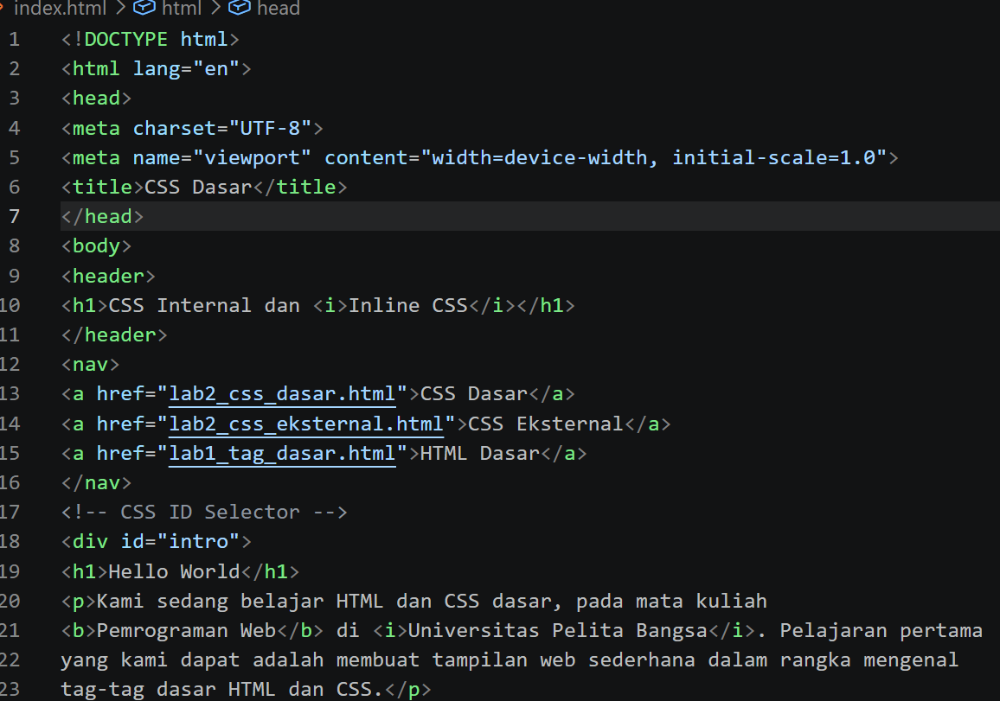
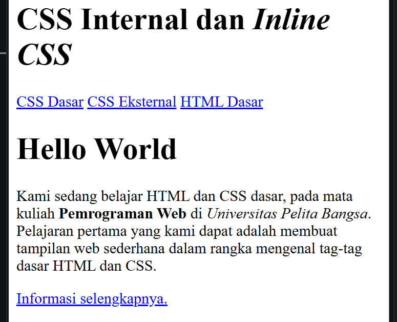
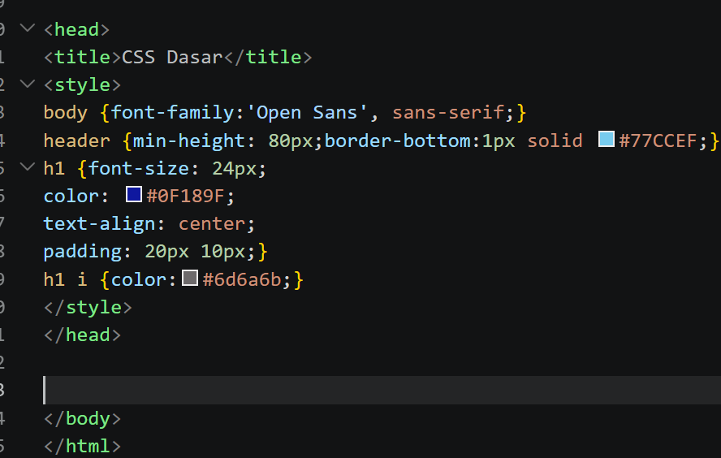
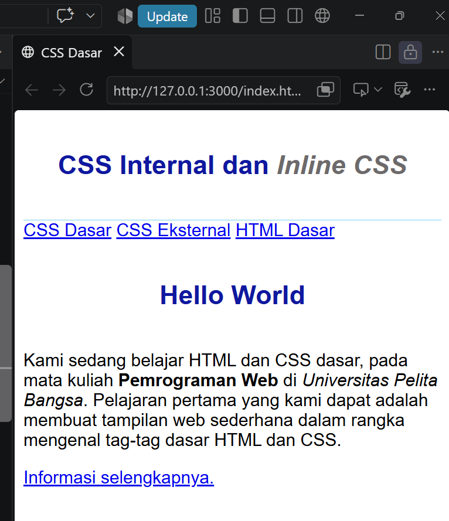
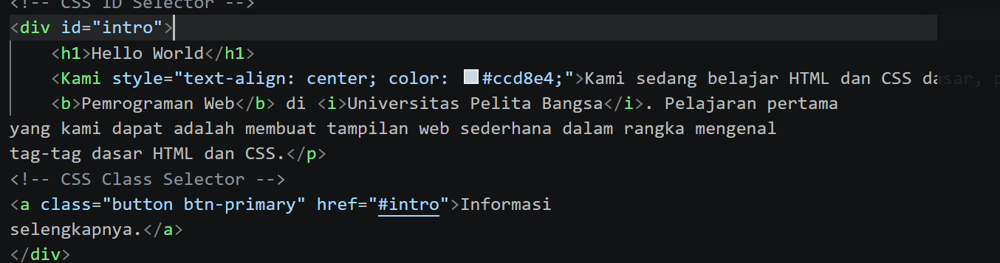
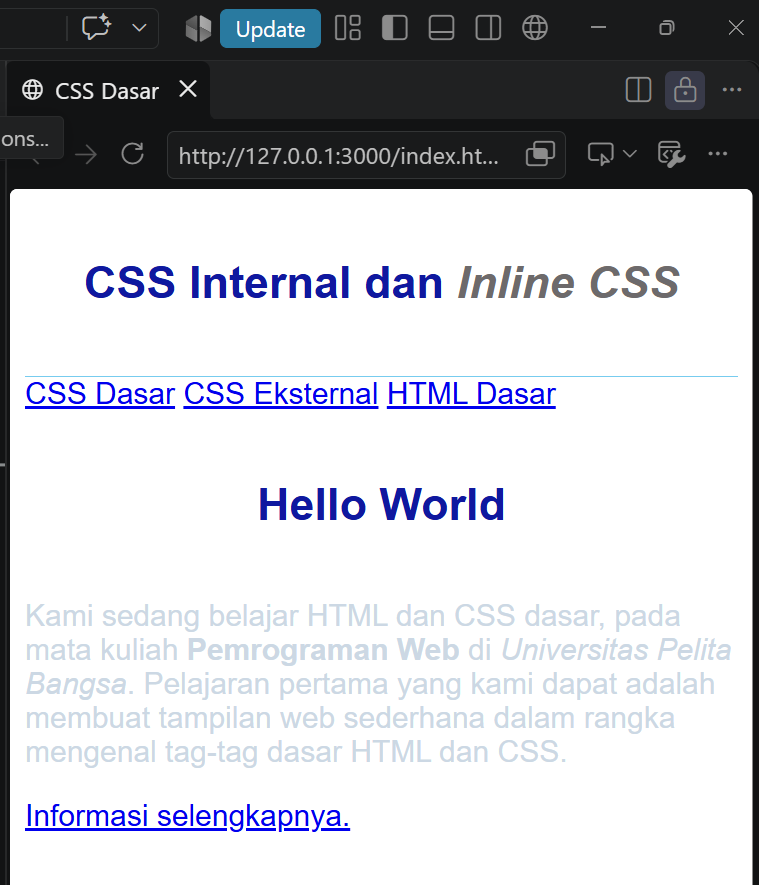
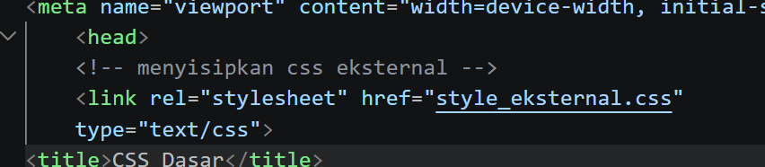
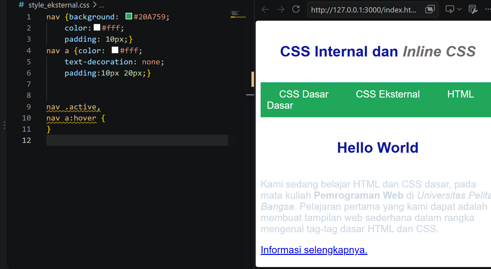
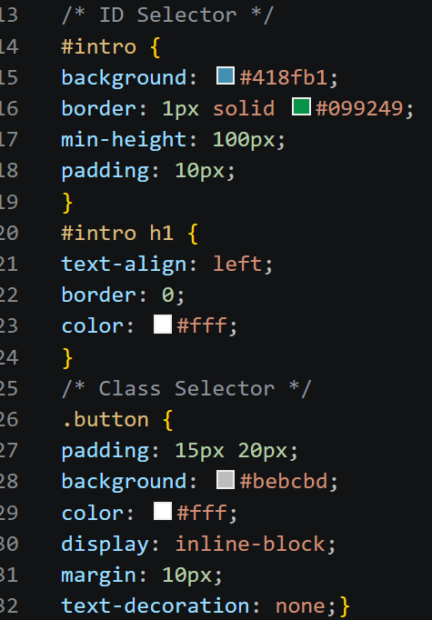
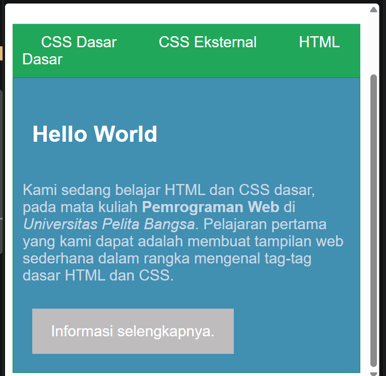

# Praktikum 3: CSS Dasar

### Identitas

**Nama:** Deti Kurnia  
**Mata Kuliah:** Pemrograman Web  
**Praktikum:** 3 – CSS Dasar  
**Repository:** Lab3Web

---

# Langkah-Langkah Praktikum

## 1. Membuat Dokumen HTML

Pertama membuat file HTML dengan nama:

```text
lab2_css_dasar.html
```

Kemudian membuat struktur dasar HTML yang terdiri dari header, navigation, div, heading, paragraph, dan link.

### Screenshot




---

## 2. Membuat CSS Internal

CSS Internal ditulis langsung di dalam file HTML menggunakan tag `<style>` pada bagian `<head>`. CSS Internal digunakan untuk mengatur tampilan halaman HTML dari dalam dokumen HTML.

### Screenshot




---

## 3. Menambahkan Inline CSS

Inline CSS merupakan CSS yang ditulis langsung pada tag HTML menggunakan atribut `style`.
Inline CSS hanya mempengaruhi elemen HTML tempat CSS tersebut dituliskan.

### Screenshot




---

## 4. Membuat CSS Eksternal

Selanjutnya membuat file CSS terpisah dengan nama:

```text
style_eksternal.css
```

CSS Eksternal digunakan agar kode CSS berada pada file yang terpisah dari HTML
Dengan menggunakan CSS Eksternal, satu file CSS dapat digunakan untuk mengatur tampilan halaman HTML.

### Screenshot




---

## 5. Menambahkan CSS Selector

Pada tahap ini digunakan ID Selector dan Class Selector.

### ID Selector

ID Selector menggunakan tanda `#`.

ID Selector digunakan untuk memberikan style pada elemen HTML yang memiliki ID tertentu.

### Class Selector

Class Selector menggunakan tanda titik `.`.
Class Selector digunakan pada elemen HTML yang memiliki atribut `class`.

### Screenshot




---

# Kesimpulan

Pada Praktikum 3 ini telah dipelajari dasar-dasar CSS untuk mengatur tampilan halaman web. CSS dapat ditulis dengan tiga cara, yaitu **Internal CSS, External CSS, dan Inline CSS**.

Selain itu, telah dipelajari penggunaan **Element Selector, ID Selector, dan Class Selector** untuk menentukan elemen HTML yang akan diberikan style.

Dengan memahami CSS, tampilan halaman HTML dapat dibuat lebih terstruktur dan menarik.

---

### SOAL

Soal 1

Lakukan eksperimen dengan mengubah dan menambah properti dan nilai pada kode CSS dengan mengacu pada CSS Cheat Sheet yang diberikan pada file terpisah dari modul ini.

Soal 2

Apa perbedaan pendeklarasian CSS elemen h1 {...} dengan #intro h1 {...}? Berikan penjelasannya!

Soal 3

Apabila ada deklarasi CSS secara internal, lalu ditambahkan CSS eksternal dan inline CSS pada elemen yang sama. Deklarasi manakah yang akan ditampilkan pada browser?

Berikan penjelasan dan contohnya!

Soal 4

Pada sebuah elemen HTML terdapat ID dan Class, apabila masing-masing selector tersebut terdapat deklarasi CSS, maka deklarasi manakah yang akan ditampilkan pada browser?

Berikan penjelasan dan contohnya!

Contoh:

<p id="paragraf-1" class="text-paragraf">

### Jawaban

Jawaban Soal 1

Saya melakukan eksperimen dengan mengubah beberapa properti CSS seperti font-family, background-color, color, font-size, text-align, dan line-height.

Contoh:

body {
font-family: Arial, sans-serif;
background-color: #f4f4f4;
}

h1 {
color: blue;
text-align: center;
font-size: 28px;
}

p {
color: black;
font-size: 18px;
line-height: 1.6;
}

Perubahan tersebut digunakan untuk melihat pengaruh property dan value CSS terhadap tampilan halaman web.

Jawaban Soal 2

Perbedaan h1 { ... } dengan #intro h1 { ... } terletak pada cakupan elemen yang diberikan CSS.

h1 { ... } akan memberikan style kepada semua elemen <h1> yang terdapat pada halaman.

Contoh:

h1 {
color: red;
}

Sedangkan:

#intro h1 {
color: blue;
}

hanya memberikan style kepada elemen <h1> yang berada di dalam elemen yang memiliki ID intro.

Contoh HTML:

<div id="intro">
    <h1>Hello World</h1>
</div>

Jadi, h1 memiliki cakupan yang lebih umum, sedangkan #intro h1 lebih spesifik karena hanya berlaku pada <h1> yang berada di dalam #intro.

Jawaban Soal 3

Jika sebuah elemen memiliki CSS Internal, CSS Eksternal, dan Inline sekaligus, maka Inline CSS memiliki prioritas lebih tinggi dibandingkan CSS Internal dan CSS Eksternal pada kondisi aturan yang sama.

Contoh CSS Eksternal:

p {
color: blue;
}

CSS Internal:

<style>
    p {
        color: green;
    }
</style>

Inline CSS:

<p style="color: red;">
    Belajar CSS
</p>

Hasil yang ditampilkan pada browser adalah teks berwarna merah, karena color: red ditulis secara langsung pada atribut style elemen tersebut.

Jawaban Soal 4

Jika sebuah elemen HTML memiliki ID dan Class, kemudian keduanya memiliki aturan CSS yang berbeda, maka ID Selector memiliki prioritas lebih tinggi daripada Class Selector.

Contoh:

.text-paragraf {
color: blue;
}

#paragraf-1 {
color: red;
}

HTML:

<p id="paragraf-1" class="text-paragraf">
    Ini adalah paragraf.
</p>

Hasilnya adalah teks akan berwarna merah, karena selector ID #paragraf-1 memiliki spesifisitas lebih tinggi daripada selector class .text-paragraf.
